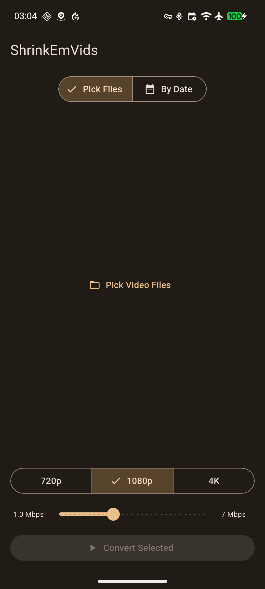
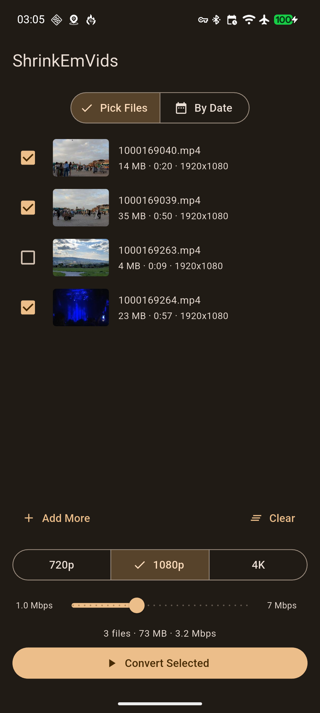
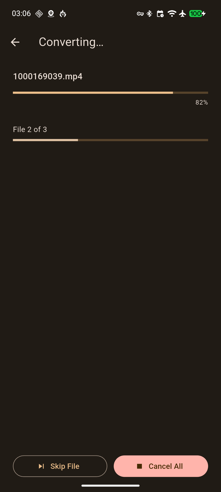
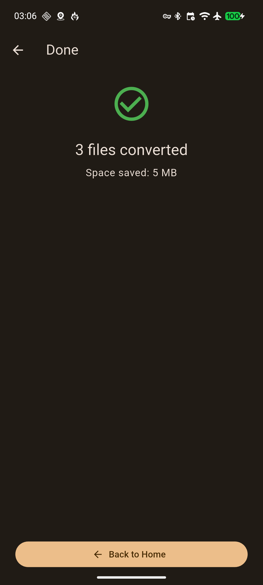

# ShrinkEmVids

<p align="center">
  
</p>

<p align="center">
  
  &nbsp;
  
  &nbsp;
  
  &nbsp;
  
</p>

Android app (Flutter) that re-encodes videos from DCIM/Camera at a lower resolution and bitrate, saving them back to your gallery to save precious storage space.

## Features

- Pick multiple videos via the native Android media picker
- **Receive videos shared from other apps** (e.g. Google Photos) — select videos in any app, tap Share → ShrinkEmVids, and they land straight in the file list
- Choose from preset quality profiles (480p, 720p, 1080p) with adjustable bitrate
- Background encoding — keeps going while the app is minimised, with a persistent notification and cancel/skip controls
- Progress screen shows per-file and overall progress
- Skips files whose compressed version already exists in DCIM/Camera
- Dynamic colour (Material You) theming

## Requirements

- Android 13+ (API 33)
- arm64-v8a device
- ADB / `flutter run` for local development

## Building

The project uses a Nix flake devShell that bundles Flutter, the Android SDK, and JDK 17.

```bash
# Enter the dev shell
nix develop

# Run on a connected device
flutter run

# Build release APK
flutter build apk --release

# Install
adb install -r build/app/outputs/flutter-apk/app-release.apk
```

> **NixOS users:** `programs.nix-ld.enable = true;` is required in your system config for Gradle-downloaded binaries (aapt2, etc.) to run.

## Testing

Unit tests cover the pure-Dart layer (models and Riverpod providers) and run entirely on the host — no device or emulator needed.

```bash
# Run all tests
flutter test

# Run a specific directory
flutter test test/models/
flutter test test/providers/

# Filter by test name (substring or regex)
flutter test --name "isEligible"
flutter test --name "buildFfmpegArgs"

# Generate an lcov coverage report
flutter test --coverage
# View with genhtml (if installed):
genhtml coverage/lcov.info -o coverage/html && xdg-open coverage/html/index.html
```

Inside the Nix dev shell, prefix commands with `nix develop --command` if you haven't entered the shell yet:

```bash
nix develop --command flutter test
```

### What is tested

| File | What it covers |
|---|---|
| `test/models/video_file_test.dart` | `isEligible`, `outputFileName`, `formattedDuration`, `copyWith`, `withMetadata` |
| `test/models/encoding_preset_test.dart` | Labels, `maxHeight`, bitrate range invariants, all `buildFfmpegArgs` flag values |
| `test/providers/selected_files_provider_test.dart` | Add/deduplicate, replace, toggle, select-all, deselect-all, update metadata, clear |
| `test/providers/selected_preset_provider_test.dart` | Default resolution and bitrate, state mutation |

## Architecture

| Layer | Details |
|---|---|
| UI | Flutter (Riverpod state management, Material You) |
| Encoding | `ffmpeg_kit_flutter_new` (sk3llo fork, `com.antonkarpenko.ffmpegkit`) — runs inside an Android `ForegroundService` |
| Kotlin side | `ConversionForegroundService` — wake lock, progress notifications, cancel/skip |
| Flutter ↔ Kotlin | `MethodChannel` for commands, `EventChannel` for streaming progress events |
| Media access | Native `MediaStore` queries via `MethodChannel`; no file_picker dependency |

## Permissions

- `READ_MEDIA_VIDEO` (Android 13+) / `READ_EXTERNAL_STORAGE` (≤ Android 12)
- `FOREGROUND_SERVICE`, `FOREGROUND_SERVICE_DATA_SYNC`
- `WAKE_LOCK`
- `POST_NOTIFICATIONS`
- No extra permissions needed for share-target — URIs are opened via `ContentResolver`

## Notable build notes

- **ProGuard / R8**: `proguard-rules.pro` keeps all `com.antonkarpenko.ffmpegkit.*` classes — R8 would otherwise rename them and break `JNI_OnLoad` in the native `.so` at runtime (crashes release build only).
- **Native lib packaging**: `jniLibs.useLegacyPackaging = true` forces `.so` files to be extracted on install. Without this, some ffmpeg-kit `.so` files fail to load from the compressed APK.
- **ABI filter**: only `arm64-v8a` is included, keeping the APK at ~30 MB.
- **Share target**: `ACTION_SEND` / `ACTION_SEND_MULTIPLE` intent-filters with `video/*` are declared in `AndroidManifest.xml`. URI resolution tries the MediaStore `DATA` column first; if the path is unreadable (Google Photos wraps URIs in its own content provider), the bytes are copied to `cacheDir/shrinkemvids_share/` via `ContentResolver.openInputStream`. Copying runs on `Dispatchers.IO` and the result is returned to Flutter asynchronously.
